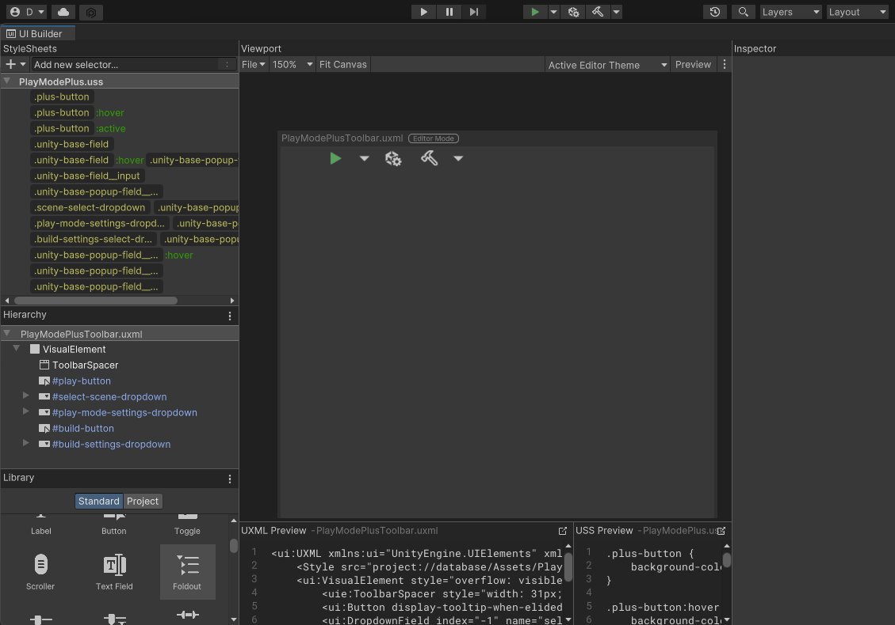
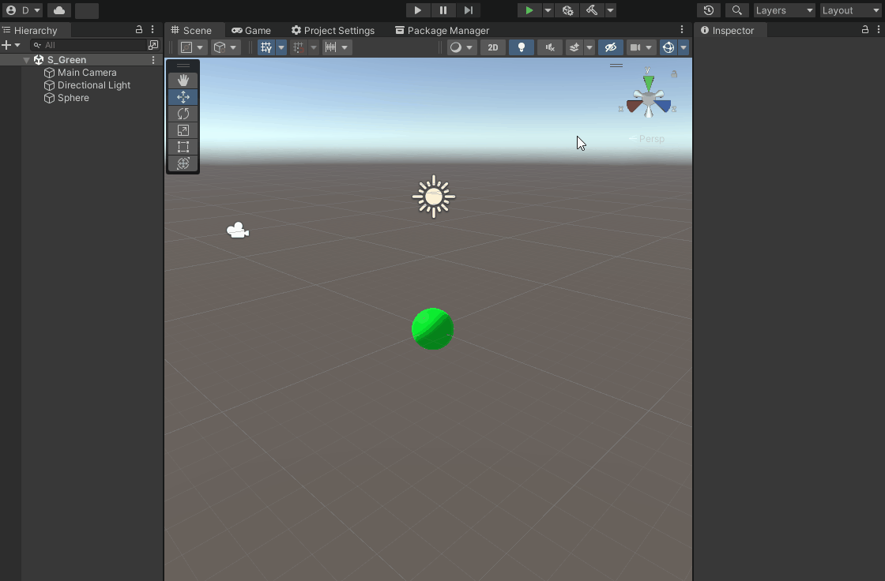
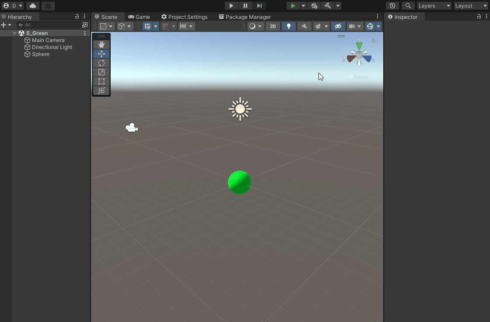

# Play-Mode-Plus

## Custom Unity Toolbar - Play mode scene selection, play mode settings, build and build presets.

### `Play Mode Plus` extends Unity toolbar by additional tools.

#### Made using `UI Builder`

## Features

- `Custom Enter Play Mode` (On pressed will play the scene you selected and will bring you back to the scene you were working on after you quit play mode)

- `Play Mode Scene Selection` (Select scene you wish to play when you press Custom Play mode button)

- `Play Mode Settings`

- `Build Shortcut`

- `Build Settings` (Loads player settings preset you created)

> Note: Only presets which contain `P_` in their name will appear in Build Settings Presets Selection menu context

## Tested on Unity `2021.3.1f1`

## License

### MIT
